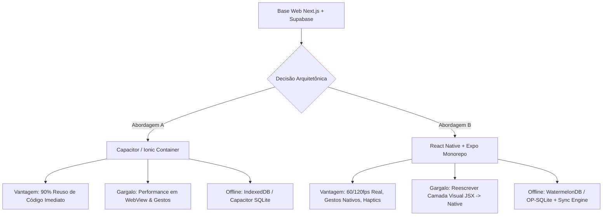
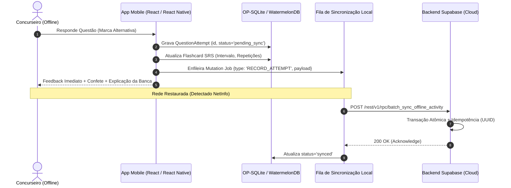
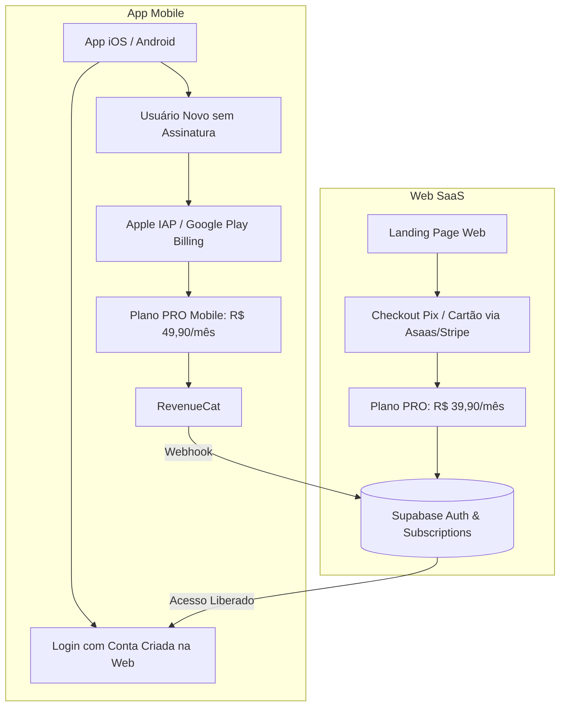

# Plano Arquitetônico: Expansão Mobile (App Store & Google Play)
**Plataforma**: Learning AI (AprovaLens)  
**Stack Atual**: Next.js 14, React 18, Tailwind CSS, Supabase (PostgreSQL, Auth, RLS, Storage)  
**Autor**: Arquiteto Chefe de Soluções Web & Mobile  

---

## 1. Sumário Executivo & Cenário Atual

O **Learning AI** opera hoje como uma Single Page / Server-Driven Application rica, responsiva e focada em concurseiros de alta performance. Para expandir a retenção de alunos — que frequentemente estudam em deslocamentos, transporte público ou bibliotecas com conectividade instável —, a presença nas lojas **Google Play Store** e **Apple App Store** é estratégica.

Contudo, levar um SaaS web educacional para mobile impõe três grandes desafios de engenharia:
1. **Escolha de runtime e custo de manutenção** (WebView encapsulada vs. Renderização Nativa).
2. **Experiência Offline-First** (resolução ininterrupta de simulados, leitura de leis e revisão de flashcards).
3. **Regulamentação rígida das Lojas** (Apple App Store Review Guidelines 3.1.1 e Google Play Billing, onde a cobrança por bens digitais impõe 15% a 30% de taxa sobre transações in-app).

---

## 2. Comparativo Tecnológico: Capacitor vs. React Native (Expo)

### 2.1. Matriz Técnica Comparativa

| Critério | Capacitor 6 (WebView Avançada) | React Native (Expo SDK 51+ / New Architecture) |
| :--- | :--- | :--- |
| **Time to Market (TTM)** | **1 a 2 semanas** (Empacota o bundle exportado estático do Next.js). | **6 a 10 semanas** (Reconstrução dos componentes visuais). |
| **Reuso de Código** | **85% - 95%** (Reutiliza HTML, CSS Tailwind, componentes React e hooks). | **40% - 50%** (Reutiliza regras de negócio, Supabase client, tipos TypeScript e lógica de estado). |
| **Performance Visual & Framerate** | 60fps em aparelhos modernos; quedas de framerate em animações pesadas (ex: swipe de flashcards e scroll infinito de Vade Mecum). | **60fps a 120fps contínuos** rodando via engine Hermes e arquitetura Fabric nativa. |
| **Experiência de Gestos (UX)** | Simulados via touch events web. Pode sofrer com atraso de 100ms e comportamento de rolagem "borrachuda" da WebView. | **Gestos nativos puros** (`react-native-gesture-handler` + `react-native-reanimated`) com resposta tátil instantânea. |
| **Armazenamento Offline** | IndexedDB (limitado por quota do OS) ou `@capacitor-community/sqlite`. | **OP-SQLite**, **WatermelonDB** ou **PowerSync** (acesso C++ direto, centenas de milhares de linhas instantâneas). |
| **Notificações & Background** | Suporte básico a Push (`@capacitor/push-notifications`). | Suporte avançado a Background Fetch, Tarefas Agendadas e Notificações Locais ricas. |
| **Risco de Rejeição na Apple** | Moderado (Diretriz 4.2: apps que são meros "sites empacotados sem valor nativo" são alvos frequentes de recusa). | Baixo (Apresenta interface 100% aderente às *Human Interface Guidelines* da Apple). |

---

### 2.2. Veredito Arquitetônico & Estratégia em Fases

> [!IMPORTANT]
> **Recomendação Estratégica**: Adotar uma estratégia em **duas fases (Progressive Native)**:
> - **Fase 1 (MVP Rápido - 15 dias)**: Lançar com **Capacitor** para marcar território nas lojas, validar aquisição orgânica mobile e testar integrações de autenticação nativa (Sign In with Apple).
> - **Fase 2 (Escala & Retenção de Longo Prazo)**: Migrar para uma estrutura **Monorepo (Turborepo) com Expo**, compartilhando `@learning-ai/types`, `@learning-ai/logic` e `@learning-ai/supabase`.

---

## 3. Arquitetura Offline-First para Funcionalidades de Estudo

Para que o concurseiro estude no metrô ou modo avião, as seguintes funcionalidades precisam operar 100% desconectadas:
1. **Resolução de Questões & Simulado**.
2. **Repetição Espaçada de Flashcards (SRS)**.
3. **Consulta à Legislação (Vade Mecum)**.

### 3.1. Engine de Dados Local
- **Banco Local**: SQLite embarcado (via `op-sqlite` no Expo ou `@capacitor-community/sqlite` no Capacitor).
- **Cache de Lei Seca e Questões**: Download prévio sob demanda (*"Baixar Módulo INSS para Estudo Offline"*). Os textos da CF/88 e leis secas são compactados em SQLite e armazenados em cache local permanente.

### 3.2. Estratégia de Resolução de Conflitos
- **Tentativas de Questões (`question_attempts`)**: Modelo **Append-Only**. Conflitos não existem porque cada tentativa é um registro imutável com UUID gerado no cliente.
- **Métricas do Usuário (`user_metrics`)**: Sincronização delta agregada no servidor via PostgreSQL RPC function (`increment_user_stats(user_id, total_answered, total_correct)`), evitando sobrescrita de contadores.
- **Flashcards SRS (Repetição Espaçada)**: Modelo **Last-Write-Wins (LWW)** baseado em `last_reviewed_at` (ISO timestamp UTC). Se o usuário revisou o mesmo card no computador e no celular, a revisão mais recente prevalece no cálculo de estabilidade.

---

## 4. Adaptação de UI/UX para Padrões Nacionais e Mobile-First

### 4.1. Safe Areas, Gestos e Sistema Operacional
- **Safe Area Insets**: Tratar o entalhe superior (*Notch / Dynamic Island*) e o indicador de início inferior (*Home Indicator* no iOS e barra de navegação no Android).
  - No CSS: `env(safe-area-inset-top)` e `env(safe-area-inset-bottom)`.
  - No Expo: `react-native-safe-area-context`.
- **Navegação**:
  - Abandonar o modelo de abas no topo da página web.
  - Adotar **Bottom Tab Navigation** (fixa na base da tela com 4 a 5 itens principais: *Início*, *Simulador*, *Questões*, *Vade Mecum*, *Perfil*).
  - Ações secundárias agrupadas em gaveta lateral (*Drawer*) ou folhas deslizantes (*Bottom Sheets*).

### 4.2. Ergonomia e Microinterações
- **Feedback Háptico (Vibração Tátil)**:
  - Acerto de questão: vibração leve de sucesso (`Haptics.notificationAsync(Success)`).
  - Erro em pegadinha de banca: vibração em pulso duplo de alerta (`Haptics.notificationAsync(Warning)`).
- **Flashcards com Swipe Fluido**:
  - Arrasto para direita: Fácil/Dominado.
  - Arrasto para esquerda: Errei/Revisar.
  - Uso de transformações de hardware via driver nativo.

---

## 5. Fluxo de Aprovação nas Lojas: Políticas de Assinatura e Pagamentos

Este é o ponto mais crítico para o modelo de negócios do **Learning AI**.

### 5.1. Regra de Ouro: Apple Guideline 3.1.1 (Bens Digitais)

> [!WARNING]
> Se o seu aplicativo desbloqueia conteúdo digital (questões, diagnósticos de IA, simulados, resumos de editais) **diretamente dentro do app**, a Apple e o Google **EXIGEM obrigatoriamente** o uso dos seus sistemas de pagamento nativos:
> - **Apple**: StoreKit 2 (In-App Purchase).
> - **Google**: Google Play Billing Library.
> 
> **Você NÃO PODE colocar botões de Pix (Asaas), Mercado Pago ou formulários de Cartão de Crédito (Stripe) dentro do app mobile para compras digitais.** Fazer isso resulta em **rejeição sumária imediata**.

### 5.2. A Taxa das Lojas (App Tax)
- **Taxa Padrão**: 30%.
- **Small Business Program (Apple & Google)**: Redução para **15%** de comissão para empresas que faturam até US$ 1 milhão por ano.
- É mandatório inscrever a conta de desenvolvedor da sua empresa no *Apple Small Business Program* e no *Google Play 15% Service Fee Tier*.

---

### 5.3. Arquitetura de Faturamento Híbrido (Estratégia Recomendada)

Para maximizar a margem de lucro e manter o Pix funcional, a arquitetura deve utilizar o padrão **Multiplataforma Unificada**:

#### Regras de Implementação para Aprovação sem Risco:
1. **Regra de Preço Diferenciado**:
   - Web: R$ 39,90/mês (via Pix ou Cartão, taxa de ~2% no gateway próprio).
   - App Stores: R$ 49,90/mês (via Apple IAP / Google Billing, absorvendo a taxa de 15%).
2. **Consumo Multiplataforma (Guideline 3.1.3(b))**:
   - A Apple permite explicitamente que o usuário acesse conteúdo no app que foi adquirido fora dele (por exemplo, na web via Pix), contanto que o mesmo item também possa ser comprado in-app OU o app seja apenas um leitor de conta existente.
3. **Camada de Orquestração com RevenueCat**:
   - Utilizar o **RevenueCat SDK** (`react-native-purchases` ou `@revenuecat/purchases-capacitor`).
   - O RevenueCat abstrai os recibos de compra da Apple e do Google, gerencia renovações automáticas, estornos e dispara webhooks para o Supabase atualizar o status do usuário em tempo real.

---

### 5.4. Checklists Obrigatórios para Submissão

#### Requisitos Mandatórios da Apple (iOS):
- [ ] **Sign In with Apple**: Se o app oferece login social (Google, etc.), é **obrigatório** oferecer também "Iniciar sessão com a Apple".
- [ ] **Exclusão de Conta (Guideline 5.1.1(v))**: O app **deve ter** um botão claro dentro das configurações do perfil para "Excluir Minha Conta e Dados". A exclusão não pode ser apenas um formulário de e-mail; deve acionar o endpoint de deleção no backend.
- [ ] **Termos de Uso (EULA) e Política de Privacidade**: Links visíveis na tela de planos e no rodapé das configurações. Para assinaturas auto-renováveis, a Apple exige termos específicos explicando período de cobrança e cancelamento nas preferências do iOS.
- [ ] **Contas de Teste para os Revisores**: Credenciais válidas de teste (login e senha) preenchidas no App Store Connect com dados simulados já carregados.

#### Requisitos Mandatórios do Google Play (Android):
- [ ] **Declaração de Segurança dos Dados (Data Safety Form)**: Detalhar quais dados são coletados (e-mail, progresso de estudo) e para qual finalidade.
- [ ] **Nível de API Alvo**: Deve compilar visando o Android 14 (API level 34) ou superior.
- [ ] **Teste Fechado Obrigatório**: Para novas contas de desenvolvedor pessoa física, o Google exige um teste fechado com pelo menos 20 testadores participando ativamente por 14 dias antes de liberar em produção.

---

## 6. Plano de Ação & Roadmap de Execução

| Etapa | Duração | Entregáveis Principais |
| :--- | :--- | :--- |
| **Fase 1: Preparação do Core** | Semana 1 | - Estruturação do monorepo com pacotes compartilhados. - Instalação e configuração do RevenueCat no Supabase. - Endpoint de exclusão de conta (`DELETE /api/user`). |
| **Fase 2: Shell Mobile & Offline Engine** | Semanas 2 e 3 | - Criação do projeto Expo com NativeWind e React Navigation. - Implementação da camada SQLite local com sincronização delta. - Suporte a safe areas e vibração háptica em questões. |
| **Fase 3: IAP & Paywall Nativo** | Semana 4 | - Telas de Paywall nativas integradas ao RevenueCat. - Verificação de assinaturas Web x Mobile no Supabase RLS. |
| **Fase 4: Compliance & Lançamento** | Semanas 5 e 6 | - Configuração do App Store Connect e Google Play Console. - Testes com TestFlight e Google Closed Beta. - Aprovação nas lojas e lançamento público. |
