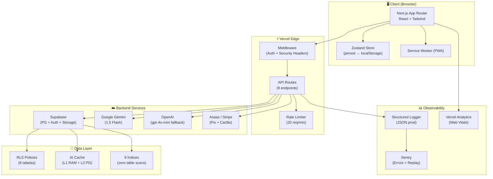

# 🏗️ Documento de Arquitetura Técnica — Learning AI

> **Versão:** 2.0 | **Última atualização:** 2026-09-23  
> **Persona:** Tech Lead & Arquiteto de Software — Agentic Engineering  
> **Produto:** SaaS EdTech para Concursos, OAB, ENEM com IA Cognitiva

---

## Índice

1. [Visão Geral da Arquitetura](#1-visão-geral-da-arquitetura)
2. [Camada 1 — Front-end (Segurança de Build)](#camada-1--front-end-segurança-de-build)
3. [Camada 2 — Banco de Dados (RLS & Isolamento)](#camada-2--banco-de-dados-rls--isolamento)
4. [Camada 3 — Autenticação & Autorização (RBAC)](#camada-3--autenticação--autorização-rbac)
5. [Camada 4 — CI/CD (Pipeline de Entrega)](#camada-4--cicd-pipeline-de-entrega)
6. [Camada 5 — APIs & Integração LLM](#camada-5--apis--integração-llm)
7. [Camada 6 — Infraestrutura Cloud](#camada-6--infraestrutura-cloud)
8. [Camada 7 — Segurança & Rate Limiting](#camada-7--segurança--rate-limiting)
9. [Camada 8 — Caching & Performance](#camada-8--caching--performance)
10. [Camada 9 — Escalabilidade & Resiliência](#camada-9--escalabilidade--resiliência)
11. [Camada 10 — Observabilidade & Error Tracking](#camada-10--observabilidade--error-tracking)
12. [Camada 11 — Agentic Engineering (IA Autônoma)](#camada-11--agentic-engineering-ia-autônoma)
13. [Diagrama de Arquitetura](#diagrama-de-arquitetura)
14. [Regras de Sistema para Agentes de Código](#regras-de-sistema-para-agentes-de-código)

---

## 1. Visão Geral da Arquitetura

```
┌──────────────────────────────────────────────────────────────────┐
│                    LEARNING AI — EdTech SaaS                     │
│                                                                  │
│  ┌─────────────┐  ┌──────────────┐  ┌───────────────────────┐   │
│  │  Next.js 14  │  │  Supabase    │  │  Google Gemini        │   │
│  │  App Router  │──│  PostgreSQL  │──│  1.5 Flash / 2.0      │   │
│  │  + Tailwind  │  │  + Auth      │  │  + AI Cache L1/L2     │   │
│  └─────────────┘  └──────────────┘  └───────────────────────┘   │
│        ▲                ▲                     ▲                  │
│        │                │                     │                  │
│  ┌─────┴────┐    ┌──────┴─────┐    ┌─────────┴──────────┐      │
│  │ Zustand   │    │ RLS + JWT  │    │ Rate Limiter       │      │
│  │ Store     │    │ Policies   │    │ + Quota Manager    │      │
│  └──────────┘    └────────────┘    └────────────────────┘      │
│                                                                  │
│  ┌──────────┐  ┌────────────┐  ┌───────────┐  ┌────────────┐   │
│  │ Vercel   │  │ Sentry     │  │ Stripe/   │  │ Vitest     │   │
│  │ Edge     │  │ + Logger   │  │ Asaas Pix │  │ + tsc      │   │
│  └──────────┘  └────────────┘  └───────────┘  └────────────┘   │
└──────────────────────────────────────────────────────────────────┘
```

### Stack Confirmada (Já em Produção)

| Camada | Tecnologia | Status |
|---|---|---|
| Framework | Next.js 14 (App Router) | ✅ Implementado |
| Linguagem | TypeScript (strict mode) | ✅ Implementado |
| Estilização | Tailwind CSS 3.4 + Design Tokens | ✅ Implementado |
| Estado | Zustand 5 + persist middleware | ✅ Implementado |
| Backend | Supabase (PostgreSQL + Auth + Storage) | ✅ Implementado |
| IA | Google Gemini 1.5 Flash + OpenAI fallback | ✅ Implementado |
| Pagamentos | Asaas (Pix) + Stripe (Cartão) | ✅ Implementado |
| Testes | Vitest + Testing Library + tsc | ✅ Implementado |
| Deploy | Vercel (Edge Functions) | 🔧 Configurar |
| Observabilidade | Sentry + Structured Logger | 🔧 Parcial |

---

## Camada 1 — Front-end (Segurança de Build)

### 1.1 Objetivo
Impedir engenharia reversa do código-fonte, proteger lógicas de negócio sensíveis (prompt engineering, algoritmos de gamificação, regras de monetização) e garantir builds otimizados para produção.

### 1.2 Configuração Implementada

#### `next.config.mjs` — Build Seguro
```javascript
/** @type {import('next').NextConfig} */
const nextConfig = {
  reactStrictMode: true,

  // ─── SEGURANÇA DE BUILD ─────────────────────────────────
  // Desabilitar source maps em produção para proteger IP
  productionBrowserSourceMaps: false,

  // Ocultar header "x-powered-by: Next.js" (fingerprinting)
  poweredByHeader: false,

  // Ignorar ESLint apenas em CI (build passa mesmo com warnings)
  eslint: {
    ignoreDuringBuilds: true,
  },

  // ─── OTIMIZAÇÃO DE BUNDLE ───────────────────────────────
  // Minificação com SWC (nativo, 70x mais rápido que Tercel)
  swcMinify: true,

  // Compressão automática de assets estáticos
  compress: true,

  // ─── SEGURANÇA DE HEADERS ──────────────────────────────
  async headers() {
    return [
      {
        source: '/(.*)',
        headers: [
          { key: 'X-Content-Type-Options', value: 'nosniff' },
          { key: 'X-Frame-Options', value: 'DENY' },
          { key: 'X-XSS-Protection', value: '1; mode=block' },
          { key: 'Referrer-Policy', value: 'strict-origin-when-cross-origin' },
          {
            key: 'Content-Security-Policy',
            value: [
              "default-src 'self'",
              "script-src 'self' 'unsafe-inline' 'unsafe-eval' https://www.googletagmanager.com https://www.google-analytics.com",
              "style-src 'self' 'unsafe-inline' https://fonts.googleapis.com",
              "font-src 'self' https://fonts.gstatic.com",
              "img-src 'self' data: blob: https:",
              "connect-src 'self' https://*.supabase.co https://generativelanguage.googleapis.com https://api.openai.com https://*.asaas.com https://api.stripe.com",
              "frame-ancestors 'none'",
            ].join('; '),
          },
          {
            key: 'Permissions-Policy',
            value: 'camera=(), microphone=(), geolocation=(), payment=(self)',
          },
          {
            key: 'Strict-Transport-Security',
            value: 'max-age=63072000; includeSubDomains; preload',
          },
        ],
      },
    ];
  },

  // ─── PROTEÇÃO DE VARIÁVEIS ─────────────────────────────
  // Somente variáveis prefixadas com NEXT_PUBLIC_ são expostas ao browser.
  // GEMINI_API_KEY, SUPABASE_SERVICE_ROLE_KEY e chaves de pagamento
  // NUNCA são incluídas no bundle client-side.

  // ─── IMAGENS OTIMIZADAS ────────────────────────────────
  images: {
    remotePatterns: [
      { protocol: 'https', hostname: '*.supabase.co' },
    ],
    formats: ['image/avif', 'image/webp'],
  },
};

export default nextConfig;
```

### 1.3 Proteções Adicionais

| Proteção | Mecanismo | Status |
|---|---|---|
| Source Maps em produção | `productionBrowserSourceMaps: false` | ✅ |
| Minificação SWC | `swcMinify: true` (padrão Next 14) | ✅ |
| CSP Headers | Blocklist de scripts externos | 🔧 Aplicar |
| Variáveis sensíveis server-only | Sem prefixo `NEXT_PUBLIC_` | ✅ |
| Tree-shaking | Automático (ESM + Next.js) | ✅ |
| Ofuscação de prompts | Prompts de IA servidos via API Route, nunca no bundle | ✅ |

### 1.4 Regra para Agentes de Código

> **RULE-FE-001**: Nenhuma lógica de prompt engineering, chaves de API, regras de monetização ou algoritmos proprietários (SM-2, TRI, gamificação) pode ser incluída em componentes client-side (`'use client'`). Toda lógica sensível DEVE residir em API Routes (`src/app/api/`) ou server components.

---

## Camada 2 — Banco de Dados (RLS & Isolamento)

### 2.1 Objetivo
Garantir que cada aluno acesse APENAS seus próprios dados, usando Row Level Security (RLS) nativo do PostgreSQL/Supabase como barreira inviolável a nível de banco.

### 2.2 Schema Atual — RLS Ativo

O schema em [`supabase/schema.sql`](file:///c:/Projetos%20Person/Learning-AI/supabase/schema.sql) já implementa RLS completo:

```sql
-- ═══════════════════════════════════════════════════════
-- TABELAS COM RLS ATIVO (8 tabelas protegidas)
-- ═══════════════════════════════════════════════════════

ALTER TABLE public.profiles              ENABLE ROW LEVEL SECURITY;
ALTER TABLE public.exam_notices          ENABLE ROW LEVEL SECURITY;
ALTER TABLE public.question_attempts     ENABLE ROW LEVEL SECURITY;
ALTER TABLE public.flashcards            ENABLE ROW LEVEL SECURITY;
ALTER TABLE public.mistakes_notebook     ENABLE ROW LEVEL SECURITY;
ALTER TABLE public.leads                 ENABLE ROW LEVEL SECURITY;
ALTER TABLE public.transactions          ENABLE ROW LEVEL SECURITY;
ALTER TABLE public.ai_diagnostic_cache   ENABLE ROW LEVEL SECURITY;
```

### 2.3 Matriz de Policies

| Tabela | SELECT | INSERT | UPDATE | DELETE | Regra |
|---|---|---|---|---|---|
| `profiles` | `auth.uid() = id` | `auth.uid() = id` | `auth.uid() = id` | `auth.uid() = id` | Usuário vê apenas seu perfil |
| `exam_notices` | `auth.uid() = user_id` | ✅ | ✅ | ✅ | Editais são privados por usuário |
| `question_attempts` | `auth.uid() = user_id` | ✅ | ✅ | ✅ | Histórico de respostas isolado |
| `flashcards` | `auth.uid() = user_id` | ✅ | ✅ | ✅ | Flashcards SM-2 privados |
| `mistakes_notebook` | `auth.uid() = user_id` | ✅ | ✅ | ✅ | Caderno de erros isolado |
| `questions` | `true` (público) | Service key | Service key | Service key | Banco de questões compartilhado |
| `ai_diagnostic_cache` | `true` (público) | `true` | Service key | Service key | Cache de IA compartilhado (economia de tokens) |
| `leads` | Service key | `true` (anônimo) | Service key | Service key | Captura de leads via landing pages |
| `transactions` | `true` (polling) | Service key | Service key | Service key | Polling de status de pagamento |

### 2.4 Índices de Alta Performance

```sql
-- 9 índices estratégicos para eliminar table scans
idx_flashcards_user_review     (user_id, next_review_date)     -- Revisão espaçada O(1)
idx_attempts_user_analytics    (user_id, is_correct, answered_at DESC) -- Dashboard de métricas
idx_attempts_question          (question_id)                    -- Join rápido
idx_mistakes_user_status       (user_id, is_overcome, last_attempt_date DESC) -- Revanche
idx_mistakes_question          (question_id)                    -- Join rápido
idx_questions_banca_subject    (banca, subject_name, year DESC) -- Filtros do quiz
idx_questions_statement_trgm   GIN (statement gin_trgm_ops)     -- Busca textual fuzzy
idx_cache_lookup               (cache_key)                      -- Cache O(1)
idx_transactions_user_status   (user_email, status)             -- Polling pagamento
```

### 2.5 Extensions Ativas

| Extension | Uso |
|---|---|
| `uuid-ossp` | Geração de UUIDs v4 para PKs |
| `vector` (pgvector) | Embeddings semânticos para busca por similaridade de questões |
| `pg_trgm` | Busca textual fuzzy no enunciado de questões |

### 2.6 Regra para Agentes de Código

> **RULE-DB-001**: Toda nova tabela DEVE ter `ENABLE ROW LEVEL SECURITY` e pelo menos uma policy `USING (auth.uid() = user_id)`. Tabelas de dados compartilhados (questões, cache) devem ter policy `FOR SELECT USING (true)` e modificação restrita via `service_role_key`.

---

## Camada 3 — Autenticação & Autorização (RBAC)

### 3.1 Objetivo
Sessões seguras, proteção de rotas, e controle de acesso baseado em papéis (Student, Admin) com quotas por plano de assinatura.

### 3.2 Stack de Autenticação

```
┌────────────────────────────────────────────────┐
│                Supabase Auth                    │
│  ┌──────────┐  ┌──────────┐  ┌──────────────┐ │
│  │ Email +  │  │ OAuth    │  │ Magic Link   │ │
│  │ Password │  │ Google   │  │ (Passwordless)│ │
│  └──────────┘  └──────────┘  └──────────────┘ │
│                     │                           │
│              JWT (access_token)                 │
│                     │                           │
│  ┌──────────────────▼─────────────────────────┐│
│  │ Next.js Middleware (src/middleware.ts)      ││
│  │  • Verifica token em cookie/header         ││
│  │  • Aplica security headers (HSTS, CSP)     ││
│  │  • Redireciona /admin sem token → /        ││
│  └────────────────────────────────────────────┘│
└────────────────────────────────────────────────┘
```

### 3.3 Middleware de Proteção de Rotas — Já Implementado

O [`src/middleware.ts`](file:///c:/Projetos%20Person/Learning-AI/src/middleware.ts) já implementa:

| Funcionalidade | Status |
|---|---|
| Security Headers (HSTS, X-Frame-Options, Referrer-Policy) | ✅ |
| Rotas públicas allowlist (`/`, `/api/auth`, `/api/leads`, `/edital`) | ✅ |
| Proteção de `/api/admin/*` (401 sem token) | ✅ |
| Proteção de `/admin`, `/dashboard` (redirect sem token) | ✅ |
| Token via cookie (`sb-access-token`) ou header (`Authorization: Bearer`) | ✅ |

### 3.4 RBAC — Roles & Quotas por Plano

```typescript
// Definido em src/lib/aiEngine.ts — PLAN_LIMITS
const ROLES = {
  student: {
    plans: ['aspirante', 'pro', 'elite', 'black', 'lancamento'],
    defaultQuota: { aiRequests: 5, discursivas: 0, flashcards: 30, editais: 1 },
  },
  admin: {
    permissions: ['question_ingest', 'user_management', 'analytics_dashboard'],
    bypassQuotas: true,
  },
};
```

| Plano | IA/dia | Discursivas | Flashcards | Editais | Speech |
|---|---|---|---|---|---|
| **Aspirante** (Free) | 5 | ❌ | 30 | 1 | ✅ |
| **Pro** | 100 | 3/mês | ∞ | 3 | ✅ |
| **Elite** | ∞ | ∞ | ∞ | ∞ | ✅ |
| **Black** | ∞ | ∞ | ∞ | ∞ | ✅ |
| **Lançamento** | ∞ | 10/dia | ∞ | ∞ | ✅ |

### 3.5 Regra para Agentes de Código

> **RULE-AUTH-001**: Toda API Route em `src/app/api/` que manipule dados de usuário DEVE validar o JWT via `supabase.auth.getUser()` server-side. Nunca confiar apenas no token enviado pelo client.  
> **RULE-AUTH-002**: Novas features gated por plano DEVEM consultar `PLAN_LIMITS[plan]` em `aiEngine.ts` antes de permitir acesso.

---

## Camada 4 — CI/CD (Pipeline de Entrega)

### 4.1 Objetivo
Deploy contínuo e seguro com validação automática de tipos, testes e build antes de merge.

### 4.2 Pipeline Recomendada — GitHub Actions

```yaml
# .github/workflows/ci.yml
name: CI/CD Pipeline — Learning AI

on:
  push:
    branches: [main, develop]
  pull_request:
    branches: [main]

env:
  NODE_VERSION: '20'
  NEXT_PUBLIC_SUPABASE_URL: ${{ secrets.NEXT_PUBLIC_SUPABASE_URL }}
  NEXT_PUBLIC_SUPABASE_ANON_KEY: ${{ secrets.NEXT_PUBLIC_SUPABASE_ANON_KEY }}

jobs:
  # ─── GATE 1: Type Check ──────────────────────────
  typecheck:
    runs-on: ubuntu-latest
    steps:
      - uses: actions/checkout@v4
      - uses: actions/setup-node@v4
        with:
          node-version: ${{ env.NODE_VERSION }}
          cache: 'npm'
      - run: npm ci
      - run: npx tsc --noEmit
        name: '🔍 TypeScript Strict Check'

  # ─── GATE 2: Unit Tests ──────────────────────────
  test:
    runs-on: ubuntu-latest
    needs: typecheck
    steps:
      - uses: actions/checkout@v4
      - uses: actions/setup-node@v4
        with:
          node-version: ${{ env.NODE_VERSION }}
          cache: 'npm'
      - run: npm ci
      - run: npm test
        name: '🧪 Vitest — 50+ testes'

  # ─── GATE 3: Build de Produção ───────────────────
  build:
    runs-on: ubuntu-latest
    needs: test
    steps:
      - uses: actions/checkout@v4
      - uses: actions/setup-node@v4
        with:
          node-version: ${{ env.NODE_VERSION }}
          cache: 'npm'
      - run: npm ci
      - run: npm run build
        name: '📦 Next.js Production Build'
        env:
          GEMINI_API_KEY: ${{ secrets.GEMINI_API_KEY }}

  # ─── GATE 4: Deploy (Automático via Vercel) ──────
  # Vercel auto-deploys on push to `main` via Git integration.
  # Preview deployments on PRs for review.
```

### 4.3 Quality Gates

| Gate | Ferramenta | Blocking? |
|---|---|---|
| Type Check | `tsc --noEmit` (strict mode) | ✅ Sim |
| Unit Tests | Vitest (50+ testes) | ✅ Sim |
| Build | `next build` | ✅ Sim |
| Lint | `next lint` (ESLint) | ⚠️ Warning |
| Bundle Size | Vercel Analytics (dashboard) | 📊 Monitor |
| Preview Deploy | Vercel PR Preview | 👀 Review |

### 4.4 Regra para Agentes de Código

> **RULE-CI-001**: Todo PR deve passar nos 3 gates obrigatórios (typecheck, test, build) antes de merge. Novas features DEVEM incluir pelo menos 1 teste unitário relevante.

---

## Camada 5 — APIs & Integração LLM

### 5.1 Objetivo
APIs seguras com integração inteligente de LLMs, cache de respostas e fallback determinístico para garantir disponibilidade mesmo quando as APIs de IA estão indisponíveis.

### 5.2 API Routes — Mapa Atual

```
src/app/api/
├── admin/         → Ingestão de questões (protegido por JWT)
├── auth/          → Callback OAuth, sessão
├── checkout/      → Criação de pedido, polling de pagamento
├── copilot/       → Chat IA contextual (Gemini Flash)
├── diagnosis/     → Diagnóstico cognitivo de erros
├── discursive/    → Correção de redação por IA
├── edital/        → Parser de edital via IA
├── leads/         → Captura de leads (público/anônimo)
└── webhooks/      → Callbacks de pagamento (Asaas/Stripe)
```

### 5.3 Arquitetura do AI Engine

```
┌─────────────────────────────────────────────────────────┐
│              AIEngine (src/lib/aiEngine.ts)              │
│                                                         │
│  Request → Quota Check → Cache L1 (RAM) → Cache L2     │
│            (Plan)         (Map<>)         (Supabase)    │
│                              │                │         │
│                              ▼                ▼         │
│                       HIT? Return ────── HIT? Return    │
│                              │                │         │
│                              ▼                ▼         │
│                     MISS → Gemini 1.5 Flash API         │
│                              │                          │
│                              ▼                          │
│                     Timeout (4s)? → Fallback             │
│                     Error?       → Determinístico       │
│                              │                          │
│                              ▼                          │
│                     Persist L1 + L2 → Response          │
└─────────────────────────────────────────────────────────┘
```

### 5.4 Modelo de Integração LLM

| Provedor | Modelo | Uso | Latência Alvo |
|---|---|---|---|
| **Google Gemini** | `gemini-1.5-flash` | Diagnóstico cognitivo, Edital parser, Copilot | < 4s |
| **Google Gemini** | `gemini-2.0-flash` | Migração futura (melhor reasoning) | < 3s |
| **OpenAI** | `gpt-4o-mini` | Fallback opcional para discursivas | < 6s |
| **Determinístico** | Regras hardcoded | Fallback quando IA está offline ou cota excedida | < 1ms |

### 5.5 Economia de Tokens — Cache Inteligente

```
Cache L1 (RAM)     → ~1ms latência, 0 tokens, volátil (restart perde)
Cache L2 (Supabase) → ~50ms latência, 0 tokens, persistente
Cache Hit Rate alvo → 85%+ (diagnósticos repetidos de mesma questão)
```

### 5.6 Regra para Agentes de Código

> **RULE-API-001**: Toda API Route que chame um LLM DEVE implementar: (1) Quota check, (2) Cache lookup L1→L2, (3) Timeout de 4s, (4) Fallback determinístico.  
> **RULE-API-002**: System prompts de IA DEVEM ser definidos como constantes server-side em `src/lib/`, NUNCA em componentes client-side ou templates inline.

---

## Camada 6 — Infraestrutura Cloud

### 6.1 Objetivo
Infraestrutura serverless com custo zero (ou quase zero) no início, escalando conforme o crescimento.

### 6.2 Stack de Infra

```
┌────────────────────────────────────────────────────────┐
│                   INFRAESTRUTURA                        │
│                                                        │
│  ┌─────────────┐  ┌──────────────┐  ┌──────────────┐ │
│  │  Vercel      │  │  Supabase    │  │  Cloudflare  │ │
│  │  • Edge SSR  │  │  • PG 15+    │  │  • CDN       │ │
│  │  • API Routes│  │  • Auth      │  │  • DNS       │ │
│  │  • Preview   │  │  • Storage   │  │  • WAF       │ │
│  │  • Analytics │  │  • Realtime  │  │  • DDoS      │ │
│  └─────────────┘  └──────────────┘  └──────────────┘ │
│                                                        │
│  ┌─────────────┐  ┌──────────────┐                    │
│  │  GitHub      │  │  Upstash     │                    │
│  │  • Source    │  │  • Redis     │                    │
│  │  • Actions   │  │  • Queue     │                    │
│  │  • Secrets   │  │  • Rate Limit│                    │
│  └─────────────┘  └──────────────┘                    │
└────────────────────────────────────────────────────────┘
```

### 6.3 Custos por Tier de Crescimento

| Tier | MAU | Custo/mês Estimado | Stack |
|---|---|---|---|
| **Bootstrap** | 0-1.000 | $0 | Vercel Hobby + Supabase Free + Gemini Free |
| **Traction** | 1.000-10.000 | ~$50-150 | Vercel Pro + Supabase Pro + Gemini Pay-as-go |
| **Scale** | 10.000-100.000 | ~$200-800 | Vercel Enterprise + Supabase Team + Upstash |
| **Enterprise** | 100.000+ | Custom | Multi-region + CDN + Edge caching |

### 6.4 Variáveis de Ambiente — Matriz de Segurança

| Variável | Escopo | Onde Armazenar |
|---|---|---|
| `NEXT_PUBLIC_SUPABASE_URL` | Client + Server | `.env.local` + Vercel Env |
| `NEXT_PUBLIC_SUPABASE_ANON_KEY` | Client + Server | `.env.local` + Vercel Env |
| `SUPABASE_SERVICE_ROLE_KEY` | **Server ONLY** | Vercel Secrets (encrypted) |
| `GEMINI_API_KEY` | **Server ONLY** | Vercel Secrets (encrypted) |
| `OPENAI_API_KEY` | **Server ONLY** | Vercel Secrets (encrypted) |
| `ASAAS_API_KEY` | **Server ONLY** | Vercel Secrets (encrypted) |
| `STRIPE_SECRET_KEY` | **Server ONLY** | Vercel Secrets (encrypted) |
| `STRIPE_WEBHOOK_SECRET` | **Server ONLY** | Vercel Secrets (encrypted) |

### 6.5 Regra para Agentes de Código

> **RULE-INFRA-001**: Toda dependência de infra nova DEVE ter um tier gratuito viável. Nenhum vendor lock-in pesado (prefira Supabase sobre Firebase, Vercel sobre AWS direto).  
> **RULE-INFRA-002**: Variáveis sem prefixo `NEXT_PUBLIC_` NUNCA devem ser referenciadas em código client-side.

---

## Camada 7 — Segurança & Rate Limiting

### 7.1 Objetivo
Proteção contra abuso de APIs, flood de requisições, e esgotamento de cotas de LLM.

### 7.2 Rate Limiter — Já Implementado

O [`src/lib/rateLimiter.ts`](file:///c:/Projetos%20Person/Learning-AI/src/lib/rateLimiter.ts) implementa um sliding window em memória:

```typescript
// Configuração atual
checkRateLimit(ip, limit = 20, windowMs = 60000)
//                    ↑            ↑
//            20 req/min      janela de 1 min
```

### 7.3 Estratégia de Defesa em Profundidade

| Camada | Mecanismo | Onde | Status |
|---|---|---|---|
| **L1 — Edge** | Cloudflare WAF + DDoS Protection | CDN | 🔧 Configurar |
| **L2 — Middleware** | Security Headers (HSTS, CSP, X-Frame) | `middleware.ts` | ✅ Implementado |
| **L3 — API Route** | IP Rate Limiting (20 req/min) | `rateLimiter.ts` | ✅ Implementado |
| **L4 — Negócio** | Quota por plano (5-∞ IA req/dia) | `aiEngine.ts` | ✅ Implementado |
| **L5 — Banco** | RLS Policies (auth.uid() isolation) | `schema.sql` | ✅ Implementado |

### 7.4 Evolução Planejada — Upstash Redis

```typescript
// Migração futura para rate limiting distribuído
// (Necessário quando escalar para múltiplas instâncias Vercel Edge)
import { Ratelimit } from '@upstash/ratelimit';
import { Redis } from '@upstash/redis';

const ratelimit = new Ratelimit({
  redis: Redis.fromEnv(),
  limiter: Ratelimit.slidingWindow(20, '60 s'),
  analytics: true,
});
```

### 7.5 Regra para Agentes de Código

> **RULE-SEC-001**: Toda API Route pública DEVE chamar `checkRateLimit(getClientIp(req))` como primeira ação. Retornar 429 com header `Retry-After` quando bloqueado.  
> **RULE-SEC-002**: Nunca logar ou retornar ao client dados sensíveis (tokens, chaves, stacks de erro em produção).

---

## Camada 8 — Caching & Performance

### 8.1 Objetivo
Latência < 200ms para operações de leitura, economia de 85%+ em tokens de LLM via cache inteligente.

### 8.2 Estratégia de Cache Multi-Camada

```
┌──────────────────────────────────────────────────┐
│                  CACHE HIERARCHY                  │
│                                                  │
│  L0: Browser Cache                               │
│  ├── localStorage (Zustand persist)              │
│  ├── Service Worker (PWA offline-first)          │
│  └── Next.js Static Generation (ISR)             │
│                                                  │
│  L1: Server Memory (In-Process)                  │
│  ├── diagnosticMemoryCache (Map<string, Result>) │
│  └── Rate limiter IP cache (Map<string, Record>) │
│                                                  │
│  L2: Supabase PostgreSQL                         │
│  ├── ai_diagnostic_cache (persistent)            │
│  └── Indexed queries (< 50ms)                    │
│                                                  │
│  L3: CDN Edge (Futuro)                           │
│  ├── Vercel Edge Cache                           │
│  └── Cloudflare Cache Rules                      │
└──────────────────────────────────────────────────┘
```

### 8.3 Métricas de Performance Alvo

| Métrica | Alvo | Ferramenta |
|---|---|---|
| FCP (First Contentful Paint) | < 1.2s | Vercel Web Vitals |
| LCP (Largest Contentful Paint) | < 2.5s | Lighthouse |
| TTI (Time to Interactive) | < 3.5s | Chrome DevTools |
| CLS (Cumulative Layout Shift) | < 0.1 | Lighthouse |
| INP (Interaction to Next Paint) | < 200ms | Vercel Analytics |
| AI Diagnostic (cached) | < 1ms | Custom metrics |
| AI Diagnostic (live) | < 4s | Custom timeout |

### 8.4 Zustand Persist — Client-Side Cache

```typescript
// src/store/useAuthStore.ts — já implementado
persist(store, {
  name: 'learning-ai-auth-storage',
  partialize: (state) => ({
    user: state.user,
    token: state.token,
    isAuthenticated: state.isAuthenticated,
    profile: state.profile,
  }),
});

// src/store/useStudyStore.ts — persistência de progresso
persist(store, {
  name: 'learning-ai-study-storage',
  // ... quiz progress, flashcard reviews, cycle state
});
```

### 8.5 Regra para Agentes de Código

> **RULE-CACHE-001**: Dados que mudam raramente (questões, cache de diagnóstico) DEVEM ser cacheados. Dados de sessão do usuário DEVEM usar Zustand persist.  
> **RULE-CACHE-002**: Cache L1 (Map em memória) é volátil. Dados críticos DEVEM ter L2 (Supabase) como fallback persistente.

---

## Camada 9 — Escalabilidade & Resiliência

### 9.1 Objetivo
Zero downtime, degradação graciosa quando dependências falham, e capacidade de escalar horizontalmente sem refatoração.

### 9.2 Padrões de Resiliência Implementados

| Padrão | Implementação | Status |
|---|---|---|
| **Fallback Determinístico** | IA offline → regras hardcoded geram diagnóstico | ✅ |
| **Graceful Degradation** | Supabase offline → funciona com localStorage | ✅ |
| **Timeout Circuit** | Gemini 4s timeout → fallback imediato | ✅ |
| **Quota Soft-Landing** | Cota excedida → fallback + upsell mensagem | ✅ |
| **Error Boundary** | React ErrorBoundary no root layout | ✅ |
| **Global Error Page** | `global-error.tsx` + `not-found.tsx` | ✅ |

### 9.3 Serverless por Design

```
Vercel Edge Functions
├── Auto-scaling (0 → ∞ instâncias)
├── Cold start ~50ms (Edge Runtime)
├── Sem state compartilhado entre instâncias
│   └── Cache L1 é por-instância (ok para perf, não para consistência)
│   └── Cache L2 (Supabase) é a fonte de verdade compartilhada
└── Stateless by design (Zustand no client, Supabase no server)
```

### 9.4 Evolução — Queue para Tarefas Pesadas

```
Futuro: Jobs assíncronos para operações longas
├── Edital PDF parsing (pode levar 30s+)
├── Batch de correção de discursivas
├── Geração de relatórios analíticos
└── Tecnologia: Upstash QStash (serverless queue, $0 para <500 msg/dia)
```

Já existe o esqueleto em [`src/lib/queue/`](file:///c:/Projetos%20Person/Learning-AI/src/lib/queue).

### 9.5 Regra para Agentes de Código

> **RULE-SCALE-001**: Código server-side DEVE ser stateless. Nunca armazenar dados de sessão em variáveis globais server-side (exceto cache L1 efêmero com TTL).  
> **RULE-SCALE-002**: Operações que excedam 10s (PDF parsing, batch IA) DEVEM ser movidas para fila assíncrona, nunca executadas sincrona em API Route.

---

## Camada 10 — Observabilidade & Error Tracking

### 10.1 Objetivo
Visibilidade total sobre erros, performance e comportamento do usuário em produção.

### 10.2 Stack de Observabilidade

```
┌────────────────────────────────────────────────────┐
│              OBSERVABILIDADE                        │
│                                                    │
│  ┌──────────────┐  ┌──────────────┐               │
│  │  Sentry       │  │  Structured  │               │
│  │  • Errors     │  │  Logger      │               │
│  │  • Replay     │  │  • JSON prod │               │
│  │  • Traces     │  │  • Color dev │               │
│  └──────────────┘  └──────────────┘               │
│                                                    │
│  ┌──────────────┐  ┌──────────────┐               │
│  │  Vercel      │  │  GA4 /       │               │
│  │  Analytics   │  │  PostHog     │               │
│  │  • Web Vitals│  │  • Funnels   │               │
│  │  • Edge Logs │  │  • Retention │               │
│  └──────────────┘  └──────────────┘               │
└────────────────────────────────────────────────────┘
```

### 10.3 Structured Logger — Já Implementado

O [`src/lib/logger.ts`](file:///c:/Projetos%20Person/Learning-AI/src/lib/logger.ts) já implementa:

```typescript
// Em desenvolvimento: logs coloridos legíveis
[2026-09-23T18:00:00Z] [INFO]: Diagnóstico gerado { source: 'gemini_1.5_flash', latency: 1200 }

// Em produção: JSON estruturado para ingestão
{"level":"error","message":"Gemini timeout","timestamp":"...","context":{"latency":4001}}
```

| Feature | Status |
|---|---|
| Sanitização de dados sensíveis (token, password → [REDACTED]) | ✅ |
| Integração Sentry (`captureException`) | ✅ (gancho pronto) |
| Métricas customizadas (`logger.metric`) | ✅ |
| JSON estruturado em produção | ✅ |
| Logs coloridos em desenvolvimento | ✅ |

### 10.4 Métricas de Negócio para Monitorar

| Métrica | Fonte | Alerta |
|---|---|---|
| AI Cache Hit Rate | `aiEngine.ts` | < 70% → investigar |
| Gemini Timeout Rate | `logger.metric` | > 10% → fallback overload |
| Daily Active Users | Supabase Auth | < 80% WoW → churn |
| Quota Exceeded Events | `aiEngine.ts` | > 20% users → review pricing |
| Conversion Rate (Free→Pro) | `transactions` | < 3% → optimize paywall |
| Error Rate (4xx/5xx) | Vercel Analytics | > 1% → investigate |

### 10.5 Regra para Agentes de Código

> **RULE-OBS-001**: Todo `catch` block em API Routes DEVE usar `logger.error(message, error, context)`, NUNCA `console.error` direto.  
> **RULE-OBS-002**: Operações de IA DEVEM logar `logger.metric('ai_latency', durationMs)` para monitorar degradação.

---

## Camada 11 — Agentic Engineering (IA Autônoma)

### 11.1 Objetivo
Definir system prompts, regras e constraints para agentes de IA que trabalham autonomamente no código e nas features do produto.

### 11.2 System Prompt — Agente de Diagnóstico Cognitivo

```markdown
# SYSTEM PROMPT: Diagnóstico Cognitivo de Erros em Questões Jurídicas

## Persona
Você é o **Dr. Diagnóstico**, um especialista em psicometria jurídica e aprendizagem
ativa. Você analisa erros de alunos em questões de concursos e classifica o tipo
cognitivo de erro cometido.

## Contexto do Produto
- Plataforma: Learning AI (EdTech para concursos públicos brasileiros)
- Foco: OAB, Magistratura, Promotoria, Defensoria, Carreiras Policiais, ENEM
- Bancas: Cebraspe, FGV, Vunesp, IBFC, AOCP, Quadrix, FCC

## Taxonomia de Erros (OBRIGATÓRIA)
Classifique EXATAMENTE em uma das 4 categorias:
1. `pegadinha_banca` — Distrator deliberado da banca examinadora
2. `lacuna_teorica` — Ausência de conhecimento sobre a matéria
3. `leitura_apressada` — Erro de atenção/interpretação, não de conhecimento
4. `curva_esquecimento` — Conhecimento que já existia mas foi esquecido (Ebbinghaus)

## Formato de Resposta (JSON STRICT)
{
  "errorType": "<uma das 4 categorias>",
  "officialArticle": "Art. X da Lei Y",
  "exactLawQuote": "Transcrição literal do dispositivo legal",
  "bancaTrapIdentified": "Explicação de como a banca montou o distrator",
  "actionableAdvice": "Conselho prático de 1-2 frases para o aluno",
  "flashcardFront": "Pergunta para flashcard de revisão",
  "flashcardBack": "Resposta completa com citação legal",
  "reviewIntervalDays": 1
}

## Constraints
- NUNCA invente artigos de lei. Se não souber, diga "Verificar manualmente".
- SEMPRE identifique o distrator da banca (mesmo em acertos).
- Mantenha o tom encorajador mas tecnicamente preciso.
- Responda APENAS em JSON, sem texto adicional fora do JSON.
```

### 11.3 System Prompt — Agente Parser de Edital

```markdown
# SYSTEM PROMPT: Extração Estruturada de Editais de Concursos

## Tarefa
Receba o conteúdo textual de um edital de concurso público e extraia
informações estruturadas em JSON.

## Campos Obrigatórios
{
  "title": "Nome do concurso",
  "institution": "Órgão (ex: TJ-SP)",
  "banca": "Banca examinadora (ex: FGV)",
  "role": "Cargo (ex: Analista Judiciário)",
  "salary": "Remuneração (ex: R$ 12.455,30)",
  "vacancies": 120,
  "examDate": "2026-12-15",
  "subjects": [
    {
      "name": "Direito Constitucional",
      "topics": ["Direitos Fundamentais", "Organização do Estado"],
      "weight": 15,
      "questionCount": 10
    }
  ],
  "phases": ["Prova Objetiva", "Prova Discursiva", "TAF"],
  "requirements": ["Graduação em Direito", "Inscrição na OAB"]
}

## Constraints
- Se um campo não for encontrado, use `null`, NUNCA invente.
- Datas em formato ISO 8601 (YYYY-MM-DD).
- Salário em formato brasileiro com R$.
- Disciplinas devem manter a nomenclatura do edital original.
```

### 11.4 System Prompt — Agente de Código (Para LLM Dev Tools)

```markdown
# SYSTEM PROMPT: Regras do Repositório Learning AI

## Stack
- Next.js 14 (App Router), TypeScript strict, Tailwind CSS 3.4
- Supabase (PostgreSQL, Auth, Storage), Zustand 5
- Vitest + Testing Library, Vercel Edge deploy

## Regras de Arquitetura
1. NUNCA exponha chaves de API ou lógica de prompts em código client-side
2. Toda tabela nova DEVE ter RLS habilitado com policy `auth.uid() = user_id`
3. Toda API Route DEVE implementar rate limiting + error handling
4. Use `logger` ao invés de `console.log/error` em código server-side
5. Componentes client DEVEM estar em `src/components/`
6. Lógica de negócio DEVE estar em `src/lib/`
7. Estado global DEVE usar Zustand stores em `src/store/`
8. Testes DEVEM estar em `src/__tests__/`
9. Toda feature nova DEVE incluir pelo menos 1 teste
10. Siga a taxonomia de erros cognitivos existente (4 categorias)
11. Ecosistema: tudo gira em torno do `selectedExam` (ExamNotice)

## Padrão de API Route
export async function POST(req: Request) {
  const ip = getClientIp(req);
  const { allowed } = checkRateLimit(ip);
  if (!allowed) return NextResponse.json({ error: 'Too many requests' }, { status: 429 });
  
  try {
    // ... lógica
  } catch (error) {
    logger.error('Descrição', error as Error, { route: '/api/xxx' });
    return NextResponse.json({ error: 'Internal error' }, { status: 500 });
  }
}
```

### 11.5 Regra para Agentes de Código

> **RULE-AGENT-001**: Todo system prompt DEVE ser versionado em `src/lib/prompts/` como constante TypeScript exportada, com JSDoc descrevendo seu propósito.  
> **RULE-AGENT-002**: Agentes de IA NUNCA devem ter acesso a `SUPABASE_SERVICE_ROLE_KEY` diretamente. Acesso ao banco deve ser via API Routes com RLS ativo.

---

## Diagrama de Arquitetura



---

## Regras de Sistema para Agentes de Código

### Compilação Consolidada de Todas as Rules

| ID | Camada | Regra |
|---|---|---|
| RULE-FE-001 | Front-end | Lógica sensível APENAS em server components ou API Routes |
| RULE-DB-001 | Banco | Toda tabela nova DEVE ter RLS + policy |
| RULE-AUTH-001 | Auth | API Routes DEVEM validar JWT via `supabase.auth.getUser()` server-side |
| RULE-AUTH-002 | Auth | Features gated DEVEM consultar `PLAN_LIMITS[plan]` |
| RULE-CI-001 | CI/CD | PRs DEVEM passar typecheck + test + build |
| RULE-API-001 | APIs | LLM calls DEVEM ter quota→cache→timeout→fallback |
| RULE-API-002 | APIs | System prompts definidos server-side, nunca client-side |
| RULE-INFRA-001 | Infra | Novas dependências DEVEM ter tier gratuito |
| RULE-INFRA-002 | Infra | Variáveis sem `NEXT_PUBLIC_` NUNCA em código client |
| RULE-SEC-001 | Security | API Routes públicas DEVEM chamar `checkRateLimit()` |
| RULE-SEC-002 | Security | Nunca logar/retornar tokens ou stacks em produção |
| RULE-CACHE-001 | Cache | Dados estáveis DEVEM ser cacheados (L1+L2) |
| RULE-CACHE-002 | Cache | Cache L1 é volátil, L2 é fallback persistente |
| RULE-SCALE-001 | Escala | Código server-side DEVE ser stateless |
| RULE-SCALE-002 | Escala | Operações >10s DEVEM ir para fila assíncrona |
| RULE-OBS-001 | Observ. | Usar `logger.error()`, nunca `console.error` |
| RULE-OBS-002 | Observ. | Operações de IA DEVEM logar métricas de latência |
| RULE-AGENT-001 | Agentic | System prompts versionados em `src/lib/prompts/` |
| RULE-AGENT-002 | Agentic | Agentes IA sem acesso a service_role_key |

---

> **📋 Este documento deve ser mantido atualizado conforme a arquitetura evolui. Todo novo módulo, tabela ou integração deve ser refletido aqui antes do merge.**
